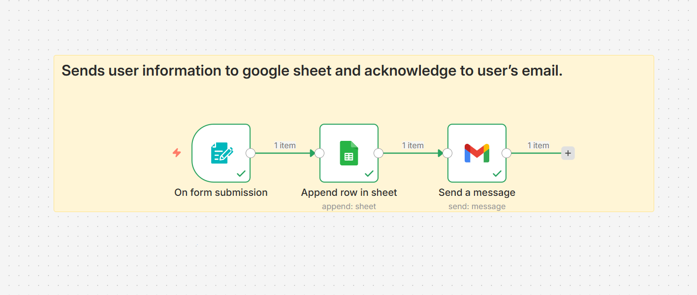

# Form Submission → Google Sheet + Email Acknowledgement (n8n)

## 📌 Overview
This n8n workflow captures user form submissions, stores the data in Google Sheets, and sends an automatic email acknowledgement to the user.

## 🧩 Workflow Steps
1. **Form Trigger**
   - Listens for user form submissions

2. **Google Sheets**
   - Appends submitted data as a new row

3. **Gmail**
   - Sends an acknowledgement email to the user

## 🖼 Workflow Diagram

## ⚙️ Prerequisites
- n8n (self-hosted or cloud)
- Google account
- Google Sheets API access
- Gmail credentials configured in n8n

## 📂 Files
- `workflow.json` → Exported n8n workflow
- `screenshots/` → Workflow images

## 🚀 How to Use
1. Import `workflow.json` into n8n
2. Update Google Sheet ID
3. Configure Gmail credentials
4. Activate workflow

## 🎯 Use Cases
- Contact forms
- Event registrations
- Lead capture systems
- Feedback forms

## 🛠 Skills Demonstrated
- n8n workflow design
- Google Sheets integration
- Email automation
- Event-driven automation
